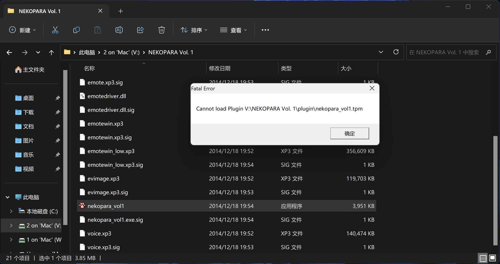

> 记录的都是使用macOS时遇到的奇奇葩葩

### Cannot load Plugin ~/../*.tpm


> 使用APFS格式的硬盘之间互传文件后,后缀文件未丢失,但在虚拟机上报错
> 千万不要用APFS格式的硬盘传Galgame,APFS保存可以,但是一定要exFAT传给它!!!
> 目前不知道原因,反正是苹果的锅

###  macOS因系统占用无法推出移动硬盘问题

> 清空后台后,还是显示占用
> **方法一:非强制性关机**
> 方法二:获取占用进程的PID

```
$ df -lh #获取你的移动硬盘名
$ diskutil unmount /dev/`对应移动硬盘名` #此时也会弹出无法推出的报错,但是会提供占用程序的PID
$ kill -9 `对应PID`
```

#### 「windows」
> 为应对虚拟机
> **方法一:非强制性关机**
> 方法二:通过管理事件查看警告内的占用程序:点击开始菜单或者win键-搜索框输入eventvwr，打开事件查看器

> https://blog.csdn.net/twocanis/article/details/124475614